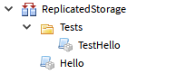
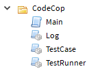

# Code Cop

Code Cop is a simple plugin for running unit tests in Roblox.

This is a replacement for Roblox's built in [TestService](http://wiki.roblox.com/index.php?title=API:Class/TestService), with support for behavior-driven development style test cases.

Get the latest version of the [Code Cop plugin](https://www.roblox.com/library/1194630699/Code-Cop) and continue reading to learn how to use it.

## Writing Tests

Tests are written similarly to frameworks like [Busted](http://olivinelabs.com/busted/) and [Mocha](http://mochajs.org/), but instead of `describe()` and `it()` functions, tests are written as tables.

Given a simple function that returns a greeting:

```lua
local function hello(name)
  return "Hello, " .. (name or "World") .. "!"
end

return hello
```

We can write test cases for it with the following:

```lua
local hello = require(script.Parent.Parent.Hello)

local tests = {
  ["hello()"] = {
    ["it should greet the whole world by default"] = function()
      assert(hello() == "Hello, World!")
    end,

    ["it should greet a person by name"] = function()
      assert(hello("John") == "Hello, John!")
    end
  }
}

return tests
```

Functions are treated as test cases, and tables are treated as containers for test cases. Using tables allows you to break up your test cases based on specific functionality, instead of grouping each case together.

The built-in `assert` function is overwritten inside each test case to give you a familiar interface to work with. You use it to verify that the condition passed to it is true. If it is, the test case passes. You can use as many `assert` calls as you like in a test case. If any assertion fails, the case fails too.

## Structuring Tests

Tests are stored as ModuleScripts under a Folder named `Test` or `Tests` (your choice). It's advised to keep this folder in the same location as the modules being tested. For example:



The `Hello` module contains the code that will be used throughout the game, while `TestHello` contains test cases to make sure it works properly.

## Running Tests

Either click on the plugin's "Run" button, or use Shift+T to run your test cases.

Everything is logged to the output window, so make sure you have that up so you can view the results.

## Caveats

It's not advisable to use this plugin when you and another user will both be working on the codebase in a Team Create.

When running tests, every ModuleScript in the game is recreated (effectively cut/pasted) so that its freed from Studio's internal cache. This allows you to make a change to your test modules or codebase and have those changes applied when running tests.

This is convenient but comes with some side-effects:

* Any ModuleScript you have open as a tab will be closed.
* Ctrl+Shift+T cannot be used to reopen any ModuleScript after running tests.
* In a Team Create environment with other users working on the codebase, running tests can result in interfering with co-workers workflows.

## Compiling

On Windows, [Elixir](https://github.com/vocksel/elixir) is used to compile the plugin's source code. Once installed, simply run `python build.py` from the root directory. The code will automatically be built to your Roblox install's `plugins` folder and you'll be able to load right into Studio to use it.

If you're not on Windows (or you don't want to install Elixir), create a `CodeCop` folder in a game and copy/paste each file's source code to script instances. `Main.lua` is a plain `Script`, while every other file is a `ModuleScript`.

It'll look something like this:



Next you should locate your Roblox plugins folder. On Windows this is under `C:\Users\You\AppData\Local\Roblox\Plugins`. Mac will be different.

Right click the CodeCop folder and select `Save to File...`, saving it in your plugins folder. You can now make changes and repeat this step to update the plugin and make sure everything works.

## License

The MIT License (MIT)

Copyright © 2017 David Minnerly

Permission is hereby granted, free of charge, to any person obtaining a copy of this software and associated documentation files (the “Software”), to deal in the Software without restriction, including without limitation the rights to use, copy, modify, merge, publish, distribute, sublicense, and/or sell copies of the Software, and to permit persons to whom the Software is furnished to do so, subject to the following conditions:

The above copyright notice and this permission notice shall be included in all copies or substantial portions of the Software.

THE SOFTWARE IS PROVIDED “AS IS”, WITHOUT WARRANTY OF ANY KIND, EXPRESS OR IMPLIED, INCLUDING BUT NOT LIMITED TO THE WARRANTIES OF MERCHANTABILITY, FITNESS FOR A PARTICULAR PURPOSE AND NONINFRINGEMENT. IN NO EVENT SHALL THE AUTHORS OR COPYRIGHT HOLDERS BE LIABLE FOR ANY CLAIM, DAMAGES OR OTHER LIABILITY, WHETHER IN AN ACTION OF CONTRACT, TORT OR OTHERWISE, ARISING FROM, OUT OF OR IN CONNECTION WITH THE SOFTWARE OR THE USE OR OTHER DEALINGS IN THE SOFTWARE.
